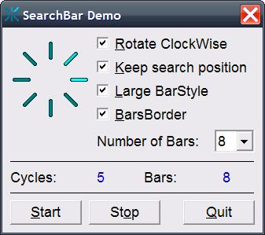



## SearchBar

### Description

Add BarBorder and BarBorderColor properties.

A simple round SearchBar control, in LED style.

If you use the WebBrowser control and searching for pages you can use this control to show the browser is searching.

After a search cycle it returns the number of cycles and bars in the event:

Cycle(Cycles As Double, Bars As Integer)

Start the control before browsing and stop it after DocumentComplete.

You can change the numbers of bars, colors.

See the control properties for more settings.
 
### More Info
 

             |
---                |---
**Submitted On**   |2011-12-09 02:00:00
**By**             |[Ben Vonk](https://github.com/Planet-Source-Code/PSCIndex/blob/master/ByAuthor/ben-vonk.md)
**Level**          |Intermediate
**User Rating**    |5.0 (15 globes from 3 users)
**Compatibility**  |VB 6\.0
**Category**       |[Custom Controls/ Forms/  Menus](https://github.com/Planet-Source-Code/PSCIndex/blob/master/ByCategory/custom-controls-forms-menus__1-4.md)
**World**          |[Visual Basic](https://github.com/Planet-Source-Code/PSCIndex/blob/master/ByWorld/visual-basic.md)
**Archive File**   |[SearchBar2220702262012\.zip](https://github.com/Planet-Source-Code/ben-vonk-searchbar__1-74156/archive/master.zip)

